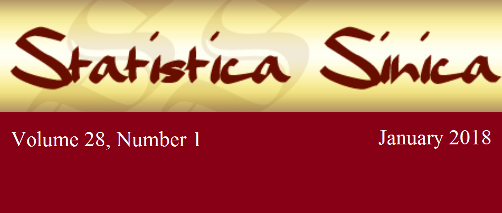

### Welcome to Jiangtao Gou's Homepage
I am currently an Assistant Professor of Biostatistics and Bioinformatics at Fox Chase Cancer Center, Temple University Health System. Before joining Fox Chase Cancer Center, I was an Assistant Professor of Mathematics and Statistics at CUNY Hunter College between 2015-18, and was a Postdoctoral Research Fellow in Industrial Engineering and Management Sciences at Northwestern University between 2014-15. I obtained my Ph.D. degree in Statistics at Northwestern University in 2014, focusing on multiple testing procedures for clinical trials.

My research mainly concerns development of complex statistical methods for health science and biomedical related problems. 
I have specific expertise in experimental design, clinical trial, data mining and quantitative research methods.

### A Brief Introduction to Multiple Tests
#### Speeding up Clinical Trials by Jiangtao Gou
Seven Minutes of Science: An Interdisciplinary Symposium, Evanston, IL, September 19, 2013

<iframe width="360" height="270"
src="https://www.youtube.com/embed/eTCsqjW_07M">
</iframe> 

### Research at a glance

  
  
  

More about Jiangtao's research: 
[[Publications]](#publications). 

### Teaching at a glance

  
  
  
  

More about Jiangtao's teaching: 
[[Statistical Education Publications]](#publications_edu). 
[[Teaching Experience]](#teaching). 
[[Academic Advising]](#advising). 

### Page map 

[[Education]](#education).

[[Publication]](#publication).

## Education 

## Publications 
[[Statistical Education]](#publications_edu).
[[Theory and Methods]](#publications_thy).
[[Applications and Case Studies]](#publications_app). 
[[Link to Google Scholar]](https://scholar.google.com/citations?user=tkdK1j4AAAAJ&hl=en) 

### Publications (Statistical Education)

1.  _J Gou_, F Zhang (2017). 
Experience Simpson’s paradox in the classroom. 
**The American Statistician** 71 (1), 61-66. 
[doi:10.1080/00031305.2016.1200485](http://dx.doi.org/10.1080/00031305.2016.1200485).

### Publications (Theory and Methods)

1. _J Gou_, AC Tamhane (2018). 
A flexible choice of critical constants for the improved hybrid Hochberg-Hommel procedure. 
**Sankhya B** 80 (1), 85-97. 
[doi:10.1007/s13571-017-0135-0](http://dx.doi.org/10.1007/s13571-017-0135-0). 

1. AC Tamhane, _J Gou_, C Jennison, CR Mehta, T Curto (2018). 
A gatekeeping procedure to test a primary and a secondary endpoint in a group sequential design with multiple interim looks. 
**Biometrics** 74 (1), 40-48. 
[doi:10.1111/biom.12732](http://dx.doi.org/10.1111/biom.12732).  
[[R package: gsrsb]](https://CRAN.R-project.org/package=gsrsb).  

1. AC Tamhane, _J Gou_ (2018). 
Advances in _p_-value based multiple test procedures. 
**Journal of Biopharmaceutical Statistics** 28 (1), 10-27. 
[doi:10.1080/10543406.2017.1378666](http://dx.doi.org/10.1080/10543406.2017.1378666). 

1. _J Gou_, AC Tamhane (2018). 
Hochberg procedure under negative dependence. 
**Statistica Sinica** 28 (1), 339-362. 
[doi:10.5705/ss.202016.0306](http://www3.stat.sinica.edu.tw/statistica/j28n1/J28N116/J28N116.html). 

1. _J Gou_, AC Tamhane (2017). 
Estimation of a parametric function associated with the lognormal distribution. 
**Communications in Statistics - Theory and Methods** 46 (16), 8134-8154. 
[doi:10.1080/03610926.2016.1175628](http://dx.doi.org/10.1080/03610926.2016.1175628). 

1. F Zhang, _J Gou_ (2016). 
A _P_-value model for theoretical power analysis and its applications in multiple testing procedures.
**BMC Medical Research Methodology** 16, 135. 
[doi:10.1186/s12874-016-0233-0](http://dx.doi.org/10.1186/s12874-016-0233-0).

1. _J Gou_, AC Tamhane, D Xi, D Rom (2014). 
A class of improved hybrid Hochberg-Hommel type step-up multiple test procedures. 
**Biometrika** 101 (4), 899-911. 
[doi:10.1093/biomet/asu032](http://dx.doi.org/10.1093/biomet/asu032).

1. _J Gou_, AC Tamhane (2014). 
On generalized Simes critical constants. 
**Biometrical Journal** 56 (6), 1035-1054. 
[doi:10.1002/bimj.201300258](http://dx.doi.org/10.1002/bimj.201300258).

### Publications (Applications and Case Studies)

1. H Neumeister, M Adelman, W Gallagher, _J Gou_, K Merrins, M Perkowski, S Shih, B Terranova, T Preuss (2017). 
Socially induced plasticity in sensorimotor gating in the African cichlid fish Astatotilapia burtoni. 
**Behavioural Brain Research** 332, 32-39.
[doi:10.1016/j.bbr.2017.05.049](http://dx.doi.org/10.1016/j.bbr.2017.05.049). 

1. Y Xie, Y Gao, _J Gou_, Y Cheng, D Honbo, K Zhang, A Agrawal,  A Choudhary (2012). 
Probabilistic macro behavioral targeting. 
DUBMMSM 2012, Proceedings of the 2012 workshop on Data-driven user behavioral modelling and mining from social media, 7-10. 
[doi:10.1145/2390131.2390135](http://dx.doi.org/10.1145/2390131.2390135). 

1. Z Yin, C Zuo, _J Gou_, J Jia (2011). 
Soil loss of different land use type in central hill region of the Sichuan basin. 
Shuili Xuebao (**Journal of Hydraulic Engineering**) 42 (3), 329-336. 

1. Z Yin, _J Gou_, Y Li (2009). 
Relationship between land use structure and soil losses watershed of central hill region of Sichuan basin. 
Nongye Xiandaihua Yanjiu (**Research of Agricultural Modernization**) 30 (3), 360-363/368. 

1. Z Yin, _J Gou_, Y Li (2009). 
Design strategies and soil erosion reduction effect of soil and water conservation measures in hilly area of central Sichuan basin. 
Nongye Xitong Kexue Yu Zonghe Yanjiu (**System Sciences and Comprehensive Studies in Agriculture**) 25 (3), 369-374. 

## Teaching
[[College and University]](#teaching_univ).
[[High School]](#teaching_high).

### Teaching at College and University  

1. Fall 2017. 
STAT 701 Advanced Probability Theory I. 
Hunter College of CUNY, New York, NY.   
[[Syllabus]](assets/doc/teaching/hunter/hunter20172_stat701syllabus_fall2017.pdf).   [[Midterm]](assets/doc/teaching/hunter/hunter20172_stat701_midterm_fall2017.pdf).  [[Final Exam]](assets/doc/teaching/hunter/hunter20172_stat701_final_fall2017.pdf).  

1. Fall 2017. 
STAT 706 General Linear Models I. 
Hunter College of CUNY, New York, NY.   
[[Syllabus]](assets/doc/teaching/hunter/hunter20172_stat706syllabus_fall2017.pdf).  [[Midterm]](assets/doc/teaching/hunter/hunter20172_stat706_midterm_fall2017.pdf).  

1. Spring 2017. 
STAT 213 Introduction to Applied Statistics. 
Hunter College of CUNY, New York, NY. 
[[Pretest]](assets/doc/teaching/hunter/hunter20171_stat213preTest_spring2017.pdf).  [[Syllabus]](assets/doc/teaching/hunter/hunter20171_stat213syllabus_spring2017.pdf).  [[Midterm]](assets/doc/teaching/hunter/hunter20171_stat213_midterm_spring2017.pdf).  [[Final Exam]](assets/doc/teaching/hunter/hunter20171_stat213_final_spring2017.pdf).  

1. Spring 2017. 
STAT 707 General Linear Models II. 
Hunter College of CUNY, New York, NY. 
[[Syllabus]](assets/doc/teaching/hunter/hunter20171_stat707syllabus_spring2017.pdf). [[Final Exam]](assets/doc/teaching/hunter20172_stat701_final_fall2017.pdf).    [[Course Content]](assets/doc/teaching/hunter/hunter20171_stat707courseContent.pdf).  

1. Fall 2016. 
STAT 213 Introduction to Applied Statistics. 
Hunter College of CUNY, New York, NY. 
[[Syllabus]](assets/doc/teaching/hunter/hunter20162_stat213syllabus_fall2016.pdf).  [[Midterm 1]](assets/doc/teaching/hunter/hunter20162_stat213_midterm1_fall2016.pdf).  [[Midterm 2]](assets/doc/teaching/hunter/hunter20162_stat213_midterm2_fall2016.pdf).  [[Final Exam]](assets/doc/teaching/hunter/hunter20162_stat213_final_fall2016.pdf).  

1. Fall 2016. 
STAT 706 General Linear Models I. 
Hunter College of CUNY, New York, NY. 
[[Syllabus]](assets/doc/teaching/hunter/hunter20162_stat706syllabus_fall2016.pdf).  [[Midterm]](assets/doc/teaching/hunter/hunter20162_stat706_midterm.pdf).  [[Final Exam]](assets/doc/teaching/hunter/hunter20162_stat706_final_fall2016.pdf).    [[Course Content]](assets/doc/teaching/hunter/hunter20162_stat706courseContent.pdf).  [[Special lecture: Kalman Filter and the Presidential Election]](assets/doc/slides/electionSlidesPrint_20161116.pdf). 

1. Spring 2016. 
STAT 213 Introduction to Applied Statistics. 
Hunter College of CUNY, New York, NY. 
[[Syllabus]](assets/doc/teaching/hunter/hunter20161_stat213syllabus_spring2016.pdf).  [[Midterm 1]](assets/doc/teaching/hunter/hunter20161_stat213_midterm1_spring2016.pdf).  [[Midterm 2]](assets/doc/teaching/hunter/hunter20161_stat213_midterm2_spring2016.pdf).  [[Final Exam]](assets/doc/teaching/hunter/hunter20161_stat213_final_spring2016.pdf). 
[[Sample student project 1: _Gender and Characteristics_ by SNO Aguilar]](assets/doc/teaching/hunter/hunter20161_stat213_GenderandCharacteristics_AguilarSNO.pdf). [[Sample student project 2: _The Effects of Sleepiness on College Students_ by Z Sharon]](assets/doc/teaching/hunter/hunter20161_stat213_spring2016_report_Zirkiev_Sharon.pdf)

1. Spring 2016. 
STAT 703 Mathematical Statistics. 
Hunter College of CUNY, New York, NY. 
[[Syllabus]](assets/doc/teaching/hunter/hunter20161_stat703syllabus_spring2016.pdf).  [[Midterm]](assets/doc/teaching/hunter/hunter20161_stat703_midterm_spring2016.pdf).  [[Final Exam]](assets/doc/teaching/hunter/hunter20161_stat703_final_spring2016.pdf).  

1. Fall 2015. 
STAT 213 Introduction to Applied Statistics. 
Hunter College of CUNY, New York, NY. 
[[Syllabus]](assets/doc/teaching/hunter/hunter20152_stat213syllabus.pdf).  [[Midterm 1]](assets/doc/teaching/hunter/hunter20152_stat213_midterm1.pdf).  [[Midterm 2]](assets/doc/teaching/hunter/hunter20152_stat213_midterm2.pdf).  [[Final Exam]](assets/doc/teaching/hunter/hunter20152_stat213_final.pdf).  

1. Fall 2013. 
STAT 202 Introduction to Statistics. 
Northwestern University, Evanston, IL. 

### Teaching at High School 

1. Winter 2013. 
Data Analysis and Statistics. 
Evanston Township High School, Evanston, IL. 
[[Teaching Certificate Program: NU-AVID program]](http://www.northwestern.edu/searle/programs-events/grad/teaching-certificate-program/nu-avid-program.html). 

1. March 2012. 
Science 167 How Planes Can Fly. 
Northwestern University SPLASH for high school students, Evanston, IL. 
[[NU SPLASH 2012 Course Catalog]](https://nusplash.learningu.org/learn/Splash/2012/catalog). 

## Academic Advising

1. Lie Leslie Liu, Master student of Mathematics and Statistics at CUNY Hunter College, June 2017. 
Nonparametric tests of quadrant dependence. 
[[Research Project by Liu]](assets/doc/students/hunter/201706_Liu_FinalThesis.pdf). 

## Presentations

## Professional Experience

1. Spring 2013. 
Statistical Consultant (Part-time). 
Feinberg School of Medicine, Northwestern University, Chicago, IL. 

1. Summer 2012. 
SAS Data Mining Summer Fellow in the Enterprise Miner R\&D organization. 
SAS Institute Inc, Cary, NC. 
[[Presentation at SAS: Relevance Feedback]](assets/doc/slides/jg_relevanceFeedbackSlides1.pdf). 

